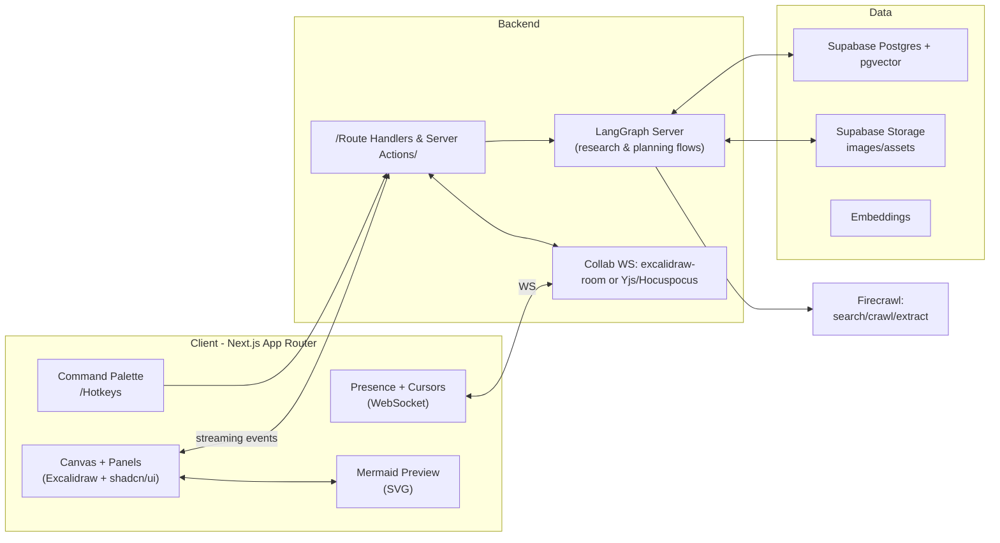
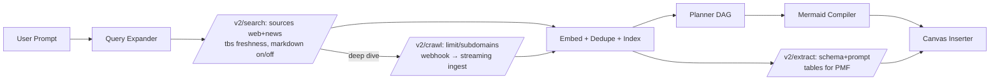

# Apo — System Plan & Firecrawl-Centric Research Layer
*Generated: 2025-09-01 21:14*

Apo is a collaborative research and planning workspace that fuses an **AI search/analysis engine** with **Excalidraw-style whiteboarding**. It auto-builds **step-by-step flowcharts** (Mermaid + generated images), surfaces **design inspiration** and **comparable products** to validate product–market fit, recommends an **efficient tech stack**, and lets teams **co-create in real time** with AI that stays current on the latest tools and frameworks.

---

## 0) Executive Summary
- **Core idea:** Discovery → Planning → Execution in one place, centered on an Excalidraw canvas enhanced by AI.
- **Major capabilities:**
  - Research: web/news search, crawling, structured extraction, dedupe + synthesis.
  - Planning: convert research into tasks/DAG; generate Mermaid flowcharts + image-enriched nodes.
  - PMF validation: find comps, features, pricing; compile competitor matrix.
  - Tech stack suggestions: efficient stacks with trade-offs and links.
  - Real-time collaboration: multiuser drawing, presence, chat, and activity feed.
- **Primary stack choices:** Next.js (App Router), Supabase (Auth, Postgres/pgvector, Storage, Realtime), **LangGraph** (agentic workflows), **Excalidraw** (canvas), **Firecrawl** (search/crawl/extract).
- **Collab transport:** Start with **excalidraw-room** (Socket.IO relay with E2E scene encryption) and augment broader presence/chat via **Supabase Realtime**. Alternative later: **Yjs + Hocuspocus**.

---

## Status at a Glance

Legend: ✅ Done · ⏳ In Progress · ❌ Not Implemented

- Core app: Next.js (App Router) + TypeScript + Tailwind v4 — ✅
- Canvas: Excalidraw renders client-side — ✅
- Shell: Workspace layout (top toolbar, right panel shell, assistant input) — ✅
- Diagrams: Mermaid preview panel (client-only) with error surfacing — ✅
- Research API: `POST /api/ai/research` (Firecrawl /v2/search) — ✅ (requires `FIRECRAWL_API_KEY`)
- Research UI: `ResearchPanel` (query, sources, tbs, markdown, results) — ⏳ (component exists; not mounted in UI)
- Diagram from prompt: `POST /api/ai/diagram` (AI SDK generateObject) — ✅ (uses OpenRouter; requires `OPENROUTER_API_KEY` or `OPENAI_API_KEY`)
- Assistant: `/api/ai/assistant` + `/api/ai/assistant/stream` tool-calling + streaming — ✅ (OpenRouter-compatible)
- LangGraph agent: `/api/ai/agent` (backend only; UI not using) — ⏳
- Collab: excalidraw-room realtime sync — ❌ (env placeholder only)
- Persistence: Supabase Auth, boards, snapshots — ❌
- Research deep dive: Firecrawl `/v2/crawl` + `/v2/extract` + webhook ingest — ❌
- Vector search: pgvector embeddings + recall — ❌
- Mermaid → Excalidraw element insertion — ✅ (auto-places DAG as nodes + arrows)
- Assistant input hover → full chat bar with model switcher + file upload — ✅
- Inspiration/PMF panels and competitor matrix — ❌
- Ops/observability: rate limiting, Langfuse/Helicone — ❌

---

## Model Providers & Setup

- OpenRouter/OpenAI (default)
  - Create an API key at https://openrouter.ai/ and set in `.env`:
    - `OPENROUTER_API_KEY="sk-or-..."`
    - Optional: `OPENROUTER_SITE_URL` and `OPENROUTER_APP_NAME`
    - `AI_MODEL` default is `openai/gpt-4o-mini` (switchable in the chat bar)
  - Compatible with OpenAI‑style endpoints via `OPENAI_BASE_URL` + `OPENAI_API_KEY`.

- Google Gemini (v2)
  - Set `GOOGLE_API_KEY` in `.env.local`.
  - Select `google/gemini-2.5-flash` in the chat bar or set `AI_MODEL=google/gemini-2.5-flash`.
  - Implementation notes:
    - Diagram API (`/api/ai/diagram`) uses the AI SDK model factory and supports the Google provider.
    - Assistant streaming uses Google’s official SDK for true token streaming and to avoid AI SDK v1/v2 spec mismatch.

Endpoints wired to OpenRouter:
- `/api/ai/assistant` and `/api/ai/assistant/stream` (tool calling)
- `/api/ai/diagram` (structured DAG → Mermaid)
- LangGraph agent (`/api/ai/agent`)

Endpoints with Google support:
- `/api/ai/assistant` and `/api/ai/assistant/stream` when `model=google/gemini-2.5-flash`
- `/api/ai/diagram` when `model=google/gemini-2.5-flash`

## Assistant Streaming & Tool‑Calling

- Streaming: unified via AI SDK v2 for both OpenAI/OpenRouter and Gemini. Text is sent as SSE `text` chunks.
- Tools available to the assistant:
  - `web_search({ query, limit?, tbs?, sources? })` — Firecrawl v2 search for fresh info.
  - `write_mermaid({ prompt?, dag? })` — returns a DAG (if needed) and emits an SSE `mermaid` event with code + DAG. The model chooses structure and style; no rigid template.
  - `draw_excalidraw({ prompt?, spec? })` — builds an Excalidraw JSON spec, converts to element skeletons, and emits an SSE `excalidraw` event. The model chooses layout; optional `layout` hints are supported.
  - `read_canvas()` — returns a compact summary of the current canvas (nodes, edges, stats, selection).
  - `search_canvas({ query, limit? })` — finds nodes by text and returns matches with neighbor edges.
  - Layout: nodes are placed by level (BFS from a likely root) with automatic wrapping (maxPerRow, default 4). The model can provide `layout: { direction: 'TB'|'LR', gapX, gapY, maxPerRow }` to influence placement.

### Prompting tips (loose guidance)
- Describe the system and relationships; the assistant decides whether to search, draw, or write Mermaid.
- If you care about layout, hint it (e.g., “top→bottom 3 columns”). Otherwise the assistant chooses.
- Examples:
  - “Sketch a YouTube-like system (frontend/back-end, player, CDN, DB).”
  - “Draw a deployment pipeline (source→build→test→deploy) in a compact 2-row layout.”

SSE events (`GET /api/ai/assistant/stream`):
- `text` — streamed tokens
- `mermaid` — `{ code, dag }` used to open/update the Diagram panel
- `excalidraw` — `{ elements }` inserted directly into the canvas
- `log`, `done` — diagnostics and completion
- `error` — structured `{ scope, message }` for missing keys, parsing failures, or tool errors; surfaced in the UI bubble

### Excalidraw Spec (for the `draw_excalidraw` tool)

The model returns JSON matching this shape (simplified):

```
{
  "nodes": [{ "id": "root", "label": "youtube clone", "kind": "box" }],
  "edges": [{ "from": "root", "to": "fe" }],
  "layout": { "direction": "TB", "gapX": 180, "gapY": 130 },
  "style": { "roundness": 0.2, "roughness": 1.6 }
}
```

The server converts this to Excalidraw element skeletons and inserts them.

### Canvas Summary (how the model "sees" the board)
- Client computes a compact summary and uploads it to `/api/canvas/summary`, returning a short `ctx` id.
- The streaming call includes `?ctx=<id>`. The model can then call `read_canvas` or `search_canvas` to inspect the scene.
- Keeps prompts small and fast versus dumping the entire scene every turn.

---

## 1) Key Decision: LangGraph over ad‑hoc tool-calling
**Why:** Apo’s workflows (deep research → synthesize → plan → diagram → cite → iterate) are **multi-step, stateful, resumable**, and benefit from **inspection, retries, branching, and checkpoints**. **LangGraph** + **LangGraph Studio** provide:
- Explicit graphs/nodes with typed I/O and guards.
- Checkpointing and resumability for long crawls/extractions.
- Visual inspection and selective retry of failed nodes.
- Managed deployment (LangGraph Platform).

---

## 2) High-Level Architecture



**Notes:**
- **Excalidraw** is already rendering in the app.
- **excalidraw-room** handles real-time drawing traffic; it **relays** E2E-encrypted scene updates but does not store scenes.
- **Supabase** powers auth, RLS-secured Postgres, `pgvector`, Storage w/ signed URLs, and Realtime presence/broadcast.

---

## 3) Core Workflows (as graphs)

### A) Research → Plan → Diagram
1. **Query Expander** → refined queries (topic, constraints, must-reads).
2. **Search** via **Firecrawl /v2/search** (sources: `web`, `news`; freshness via `tbs`; `scrapeOptions` for markdown).
3. **Crawl/Extract** deeper sources:
   - **/v2/crawl** to fetch many pages (with webhook/WS updates).
   - **/v2/extract** to build structured tables (features/pricing).
4. **Normalize & Deduplicate** → embed chunks in `pgvector`; cluster + cite.
5. **Planner** → tasks, phases, DAG (typed JSON).
6. **Diagrammer** → Mermaid `flowchart` (with `subgraph` per phase); validate and preview.
7. **Canvas Integrator** → convert nodes/edges to Excalidraw elements (rect + text + icon/image); keep Mermaid as **spec**.

### B) Design Inspiration
- Use Firecrawl search (and optionally crawl) across design galleries and app docs; present a **thumbnail grid**; drag cards to canvas.

### C) Comparable Products / PMF Validation
- Select competitor URLs → **/v2/extract** to fill a structured **Competitor Matrix** (features, pricing, target audience, differentiators).

### D) Tech‑Stack Recommender
- Blend **fresh searches** (changelogs/benchmarks) + vector recall; output recommended stack with trade‑offs and links.

---

## 4) Firecrawl Integration (v2)

### What we use
- **/v2/search** — SERP results grouped by source (web/news/images) and **optional scraped markdown** for each hit.
- **/v2/crawl** — site/domain crawling with limits, subdomains, cache, and **webhooks** for streaming ingestion.
- **/v2/extract** — LLM-based **structured extraction** with JSON Schema and optional `prompt`; job/status APIs.
- **/v2/scrape** — single-page scrape (used internally by search/crawl/extract; can be called directly when needed).

### End-to-End Pipeline with Firecrawl



### Example Requests

**Search (fresh + markdown snippets)**
```json
POST https://api.firecrawl.dev/v2/search
{
  "query": "AI whiteboard planning tools comparison",
  "limit": 8,
  "sources": ["web", "news"],
  "tbs": "w",
  "scrapeOptions": {
    "formats": ["markdown"],
    "onlyMainContent": true,
    "storeInCache": true
  }
}
```

**Crawl (domain deep dive with webhook)**
```json
POST https://api.firecrawl.dev/v2/crawl
{
  "url": "https://example.com/docs",
  "limit": 200,
  "allowSubdomains": true,
  "crawlEntireDomain": false,
  "scrapeOptions": {
    "formats": ["markdown"],
    "parsers": ["pdf"],
    "storeInCache": true
  },
  "webhook": {
    "url": "https://yourapp.com/api/firecrawl/webhook",
    "events": ["started","page","completed"],
    "metadata": {"projectId":"{project_id}"}
  }
}
```

**Extract (competitor features/pricing)**
```json
POST https://api.firecrawl.dev/v2/extract
{
  "urls": ["https://competitor-1.com/pricing","https://competitor-2.com/features"],
  "schema": {
    "type":"object",
    "properties": {
      "product":{"type":"string"},
      "plans":{"type":"array","items":{"type":"object","properties":{"name":{"type":"string"},"price":{"type":"string"},"features":{"type":"array","items":{"type":"string"}}}}},
      "key_features":{"type":"array","items":{"type":"string"}},
      "target_users":{"type":"string"}
    }
  },
  "prompt": "Extract normalized pricing tiers and key features for a competitor matrix.",
  "scrapeOptions": {
    "formats": ["markdown"],
    "onlyMainContent": true
  }
}
```

### TypeScript Wrapper (used by tools & routes)

```ts
// src/lib/ai/tools/firecrawl.ts
const FC_URL = 'https://api.firecrawl.dev/v2';
const HDRS = (key: string) => ({ 'Authorization': `Bearer ${key}`, 'Content-Type': 'application/json' });

export async function fcSearch(args:{
  query: string; limit?: number; sources?: ('web'|'news'|'images')[]; tbs?: string; location?: string; scrapeOptions?: any;
}) {
  const res = await fetch(`${FC_URL}/search`, {
    method:'POST', headers: HDRS(process.env.FIRECRAWL_API_KEY!), body: JSON.stringify(args)
  });
  return res.json();
}

export async function fcCrawlStart(args:{
  url:string; limit?:number; allowSubdomains?:boolean; crawlEntireDomain?:boolean; scrapeOptions?:any; webhook?:{url:string; metadata?:any; events?:string[]};
}){
  const res = await fetch(`${FC_URL}/crawl`, { method:'POST', headers: HDRS(process.env.FIRECRAWL_API_KEY!), body: JSON.stringify(args) });
  return res.json();
}

export async function fcCrawlStatus(id:string){
  const res = await fetch(`${FC_URL}/crawl/${id}`, { headers: HDRS(process.env.FIRECRAWL_API_KEY!) });
  return res.json();
}

export async function fcExtractStart(args:{
  urls:string[]; schema?:any; prompt?:string; scrapeOptions?:any
}){
  const res = await fetch(`${FC_URL}/extract`, { method:'POST', headers: HDRS(process.env.FIRECRAWL_API_KEY!), body: JSON.stringify(args) });
  return res.json();
}

export async function fcExtractStatus(id:string){
  const res = await fetch(`${FC_URL}/extract/${id}`, { headers: HDRS(process.env.FIRECRAWL_API_KEY!) });
  return res.json();
}
```

### Webhook Route (ingest to Supabase)

```ts
// src/app/api/firecrawl/webhook/route.ts
import { NextRequest, NextResponse } from 'next/server';
import { upsertPage, recordJobEvent } from '@/lib/db/queries';

export async function POST(req: NextRequest) {
  const payload = await req.json(); // verify signature/shared secret if configured
  const { type, data, jobId, metadata } = payload;
  await recordJobEvent(jobId, type, payload);

  if (type === 'crawl.page' && data?.markdown) {
    await upsertPage({
      projectId: metadata?.projectId,
      url: data.url,
      title: data.title,
      faviconUrl: data.favicon,
      raw_md: data.markdown
    });
  }

  if (type === 'extract.completed' && data?.result) {
    // persist structured table for competitor matrix, etc.
  }

  return NextResponse.json({ ok: true });
}
```

---

## 5) Real-Time Collaboration

### Recommended (MVP): **excalidraw-room (Socket.IO)**
- Matches Excalidraw’s protocol, **E2E-encrypted scene** updates, lightweight to host.
- Use it **only** for scene sync; persist snapshots to DB via our own API.

### Alternative (Post-MVP): **Yjs + Hocuspocus**
- CRDT-based shared state for **notes, specs, tables** beyond the canvas.
- Migrate the canvas later if you want uniform CRDT semantics.

### Presence/Chat/Activity: **Supabase Realtime**
- Presence (avatars, cursors), Broadcast (ephemeral channel messages), and DB change feeds for comments/tasks.
- Keep channels **private** with RLS-based authorization.

---

## 6) Data Model (Supabase)
**Primary tables**
- `orgs` (id, name, created_at)
- `memberships` (org_id, user_id, role)
- `projects` (org_id, name, settings)
- `boards` (project_id, title, collab_room_id, excalidraw_scene_v)
- `board_versions` (board_id, scene_json, created_by, created_at)
- `assets` (board_id, file_path, kind ['image','svg'], meta) — files live in Supabase Storage (bucket `assets`).
- `ai_sessions` (project_id, graph_name, status, created_by)
- `ai_messages` (session_id, role, content, citations[], created_at)
- `research_sources` (project_id, url, title, favicon_url, raw_md, hash)
- `doc_chunks` (source_id, chunk_id, text, embedding VECTOR, meta)
- `recommendations` (project_id, type ['tech_stack','competitors'], payload jsonb)
- `firecrawl_jobs` (id, kind ['search','crawl','extract'], project_id, status, params, created_at)
- `firecrawl_events` (job_id, type, payload, created_at)

**DDL Sketch (selected)**
```sql
create extension if not exists vector;

create table research_sources (
  id bigint generated always as identity primary key,
  project_id uuid references projects(id) on delete cascade,
  url text not null,
  title text,
  favicon_url text,
  raw_md text,
  hash text unique,
  created_at timestamptz default now()
);

create table doc_chunks (
  id bigint generated always as identity primary key,
  source_id bigint references research_sources(id) on delete cascade,
  chunk_id text,
  text text,
  embedding vector(3072),
  meta jsonb
);
create index on doc_chunks using hnsw (embedding vector_l2_ops);
```

**RLS & Storage**
- RLS on all tables (org scoping).
- Supabase Storage: signed URLs, short TTLs; thumbnails via image transform service.
- Realtime channels: **private**; enforce with RLS and JWT claims.

---

## 7) Frontend UX

- **Canvas Toolbar**
  - “Generate Flow” → opens **Diagram Panel** (Mermaid editor + preview + errors).
  - “Insert from Mermaid” → parse/validate code → insert nodes/edges + icons.
- **Research Panel**
  - Source chips (Web/News/Images), `tbs` dropdown (week/month/year), “Scrape results” switch.
  - Results with title, favicon, snippet; drag to canvas as **reference cards**.
  - “Add to Knowledge” → ingest to vector store and cite later.
- **Inspiration Panel**
  - Thumbnails grid with tags/filters; drag to canvas.
- **PMF Panel**
  - Competitor Matrix table; drag summaries to canvas.
- **Presence & Chat**
  - Avatars, cursors, typing; slash-commands (`/research`, `/plan`, `/diagram`).
- **Command Palette (⌘K)**
  - Quick actions to kick off research, create flows, insert references, toggle panels.

---

## 8) Mermaid + Images Strategy
- **Preview** with Mermaid parser/runner in a client-only component (dynamic import) to catch syntax errors early.
- **Board insertion**: Convert Mermaid spec to Excalidraw **groups**: `rect + text + tiny icon` (from **Iconify**) and optional **image** (from Supabase Storage). Keep nodes draggable/editable.
- Optional server auto-layout (Dagre/ELK) for stable coordinates before creating elements.

---

## 9) Models & Tools
- **Agent Orchestration:** LangGraph (graphs for Research, Plan→Diagram, PMF Compare).
- **Search/Crawl/Extract:** Firecrawl (v2 endpoints).
- **Vector Embed:** pgvector; choose your embedding model (e.g., 3k‑dim).
- **Observability:** Langfuse (OSS) and/or Helicone (gateway + metrics).
- **Realtime Voice/Streaming (optional later):** add Realtime APIs if needed for voice co-pilot.

---

## 10) Security & Privacy
- **excalidraw-room** scene updates are E2E encrypted; server acts as relay.
- **RLS** everywhere; Storage buckets locked down with signed URLs.
- **Least-privileged** service keys; rate limiting on research endpoints (Upstash/Unkey).
- Respect website robots/ToS for crawling; allow org-level “no-cache” runs for sensitive data.

---

## 11) Freshness Strategy
- Always prefer **fresh search** via Firecrawl with `tbs` (past week/month) and source `news` when topical.
- Blend with **project/org vector recall**; allow users to **pin sources** for persistent knowledge.
- Track `last_crawled_at`; add **Refresh** button to re-crawl targets.

---

## 12) Dev & Ops
- **Deployments**
  - Next.js on Vercel.
  - **excalidraw-room** on Railway/Render/Fly; autoscale; health checks.
  - LangGraph app on LangGraph Platform (managed).
  - Supabase project (auth, DB, Storage, Realtime).
- **Tracing/Metrics**
  - Langfuse dashboards; gateway metrics via Helicone.
- **Testing**
  - Unit tests for tools (search, crawl, extract, diagram compile).
  - Golden tests for Mermaid generation.
  - Multiplayer WS simulations (ghost cursors).

---

## 13) Milestones

1) **MVP (Weeks 1–2)**
   - Excalidraw canvas + **excalidraw-room** collab.
   - Supabase Auth, projects/boards; board snapshots.
   - Research panel wired to **Firecrawl /v2/search**; ingest & embed; Mermaid preview panel.

2) **Flow Authoring (Weeks 3–4)**
   - Planner → Mermaid compiler → **Insert to canvas** with icons.
   - Citations sidebar; board versioning.

3) **Inspiration & PMF (Weeks 5–6)**
   - Inspiration surfacer; competitor matrix (via **/v2/extract**); recommendations panel.

4) **Polish & Ops**
   - Presence/chat via Supabase; rate limiting; Langfuse dashboards; caching and queues.

---

## 14) API Surface (Selected)

**Server Routes (Next.js)**
- `POST /api/ai/research` → Firecrawl search → upsert sources, embed, stream results. — ✅ Implemented
- `POST /api/ai/crawl` → start crawl (webhook configured). — ❌ Not implemented
- `POST /api/ai/extract` → start extraction (schema + prompt). — ❌ Not implemented
- `POST /api/firecrawl/webhook` → handle crawl/extract events; ingest pages and structured data. — ❌ Not implemented
- `POST /api/ai/diagram` → DAG→Mermaid compile; return SVG + Excalidraw elements. — ✅ Implemented (returns Mermaid now)
- `POST /api/canvas/insert` → upsert elements + snapshot to `board_versions`. — ❌ Not implemented
- `POST /api/ai/assistant` → single-input assistant with tool-calling. — ✅ Implemented
- `GET /api/ai/assistant/stream` → SSE streaming for assistant. — ✅ Implemented
- `POST /api/ai/agent` → LangGraph agent (backend only). — ⏳ Present, not wired in UI

**LangGraph Tools**
- `search_web({ q, tbs?, sources?, limit?, scrapeOptions? })`
- `crawl_site({ url, limit?, allowSubdomains?, entireDomain?, scrapeOptions?, webhook? })`
- `extract_structured({ urls[], schema, prompt?, scrapeOptions? })`
- `compile_mermaid({ dag }) -> { code, errors? }`
- `excalidraw_insert({ elements, assets })`

---

## 15) Next.js File Structure (`src/`)

```
src/
  app/
    (marketing)/
      page.tsx
    dashboard/
      layout.tsx
      page.tsx
      boards/
        [boardId]/
          page.tsx                 # Canvas + right panel
          actions.ts               # Server actions for board ops
    api/
      ai/
        research/route.ts          # Firecrawl search + ingest
        crawl/route.ts             # start crawl
        extract/route.ts           # start extract
        diagram/route.ts           # compile Mermaid + return Excalidraw elements
        recommend/stack/route.ts   # (optional) tech stack recommender
      firecrawl/
        webhook/route.ts           # handle crawl/extract events
      collab/
        token/route.ts             # WS tokens (if needed)
      assets/
        upload/route.ts            # signed uploads (Supabase Storage)
  components/
    canvas/ExcalidrawCanvas.tsx    # wraps @excalidraw/excalidraw
    panels/ResearchPanel.tsx
    panels/DiagramPanel.tsx        # Mermaid editor + preview
    panels/InspirationPanel.tsx
    panels/JobsDrawer.tsx          # crawl/extract progress
    presence/PresenceBar.tsx
    ui/…                           # shadcn/ui components
  lib/
    excalidraw/
      toElements.ts                # Mermaid DAG -> Excalidraw elements
      fromElements.ts              # (optional) reverse mapping
    mermaid/
      preview.client.ts            # dynamic import + parse/run
      compile.ts                   # server-side layout utils (ELK/Dagre)
    ai/
      client.ts                    # model client & streaming helpers
      tools/
        firecrawl.ts               # wrapper for v2 endpoints
      graphs/
        deepResearch.graph.ts      # LangGraph definitions
        planToDiagram.graph.ts
        pmfCompare.graph.ts
    supabase/
      client.browser.ts
      client.server.ts
      rls.ts                       # RLS helpers
      storage.ts                   # signed URL helpers
      realtime.ts                  # presence/broadcast channels
    db/
      schema.ts                    # drizzle/zod or SQL
      queries.ts
    auth/
      getSession.ts
  styles/
  hooks/
  utils/
  middleware.ts                    # rate limiting (Upstash/Unkey), auth guards
```

---

## 16) What We Can Ship Immediately
- **Collab:** run `excalidraw-room`; point client to it; snapshot scenes to DB.
- **Research:** wire **Firecrawl /v2/search** with `tbs` and optional `scrapeOptions` (markdown). Ingest to `pgvector` and show citations.
- **Mermaid:** client preview + error surfacing; **Insert to Canvas** converts nodes/edges with icons (Iconify).
- **Orchestration:** implement **deepResearch** graph calling Search → (optional Crawl/Extract) → Cluster → Outline → Plan → Diagram.

---

## 17) Open Questions / Later Enhancements
- Self-host Firecrawl (for privacy/compliance) vs stay on hosted.
- Move all collaboration to CRDT (Yjs) or hybrid (canvas on room, other panels on Yjs)?
- Add voice co-pilot (Realtime API) for live ideation on the canvas.
- Add cost dashboard per org (calls, credits, crawl pages).

---

## Quickstart (current repo state)

- Requirements: Node 18+ (or 20+), pnpm/npm, a Firecrawl API key (optional for Research), and either an OpenRouter API key or a Google API key for AI features.
- Setup:
  1) Copy .env.example to .env. Set `OPENROUTER_API_KEY` (or `GOOGLE_API_KEY`) and `FIRECRAWL_API_KEY` if you want Research to work.
  2) Install deps: npm install
  3) Run dev server: npm run dev (cleans `.next/` before starting)
  4) Open http://localhost:3000

- What you can do now:
  - Draw on the Excalidraw canvas.
  - Use the bottom input to prompt Apo. The chat bar defaults to a clean search-bar; chips and options appear on hover. Choose `google/gemini-2.5-flash` or an OpenRouter model. If a diagram is produced, it auto-opens the Diagram panel and inserts nodes/edges on the canvas. When the assistant draws directly, elements are inserted via `excalidraw` SSE without opening the diagram panel.

- New files added in this iteration:
  - src/components/Workspace.tsx — top bar + right-side panels wiring.
  - src/components/mermaid/MermaidContext.tsx — shared state so Research panel can populate Diagram panel.
  - src/components/panels/DiagramPanel.tsx — client-only Mermaid editor + preview and “Generate from prompt” via AI SDK.
  - src/components/panels/ResearchPanel.tsx — query UI calling our research API and “Generate Flow” (Firecrawl + LangChain + 4o-mini).
  - src/app/api/ai/research/route.ts — calls Firecrawl /v2/search.
  - src/app/api/ai/research-plan/route.ts — Firecrawl search → LangChain (OpenRouter) → DAG + Mermaid.
  - src/app/api/ai/diagram/route.ts — uses AI SDK (OpenRouter) to produce DAG + Mermaid.
  - src/app/api/ai/assistant/… — OpenRouter-backed assistant (tool calling; SSE streaming route emits Mermaid + DAG events).
  - src/lib/ai/tools/firecrawl.ts — minimal wrapper.
  - src/lib/ai/client.ts — AI SDK client configured for OpenRouter by default.
  - src/lib/ai/schemas.ts — Zod DAG schema used by AI.
  - src/lib/mermaid/compile.ts — DAG→Mermaid compiler.
  - src/lib/board/dagToExcalidraw.ts — DAG→Excalidraw skeletons.
  - src/lib/board/events.ts — app-wide event to insert diagrams on the board.
  - .env.example — template for env vars.
  - IMPLEMENTATION_STATUS.md — running status of implemented/partial/not implemented and what’s needed from you.

- Notes:
  - Live collaboration via excalidraw-room is not yet enabled (needs server URL & integration step).
  - No DB persistence yet; next step is Supabase Auth + board snapshots.
  - AI diagram generation uses OpenRouter by default. Set `OPENROUTER_API_KEY` (preferred) or use `GOOGLE_API_KEY` for Gemini. Default model is `AI_MODEL` (defaults to `openai/gpt-4o-mini`).

## Troubleshooting

- Runtime TypeError: Cannot read properties of undefined (reading 'call') — Next.js 15.5.2 (Webpack)
  - Usually caused by a stale `.next/` cache or mismatched lockfile root.
  - Fixes:
    - Stop dev server, then `npm run clean && npm run dev`.
    - Ensure there is only one lockfile in this workspace (remove any root-level `package-lock.json` that is outside the repo).
    - If you prefer Turbopack, set `next dev --turbopack` but make sure the repository root is pinned (we set `turbopack.root = __dirname` in `next.config.js`).

## Current Implementation Snapshot

See IMPLEMENTATION_STATUS.md for a living view of:
- Implemented pieces
- Partial/placeholder items
- Not implemented (planned)
- Decisions/APIs needed from you

---

**End of document.**
